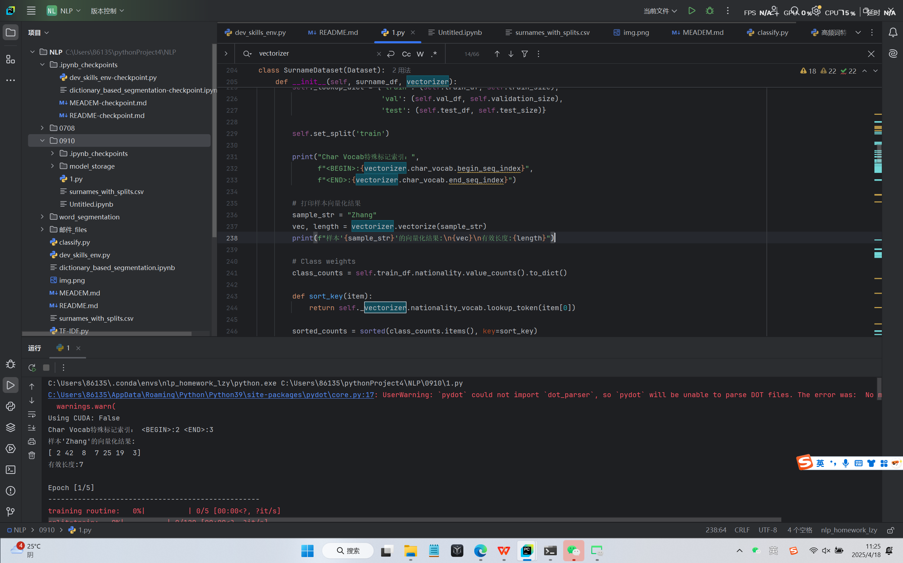
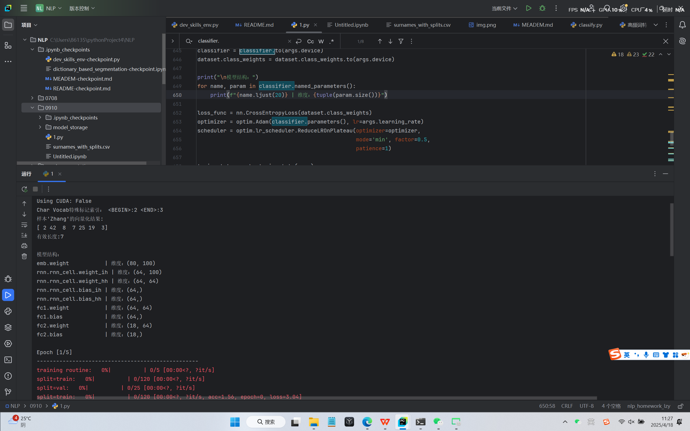
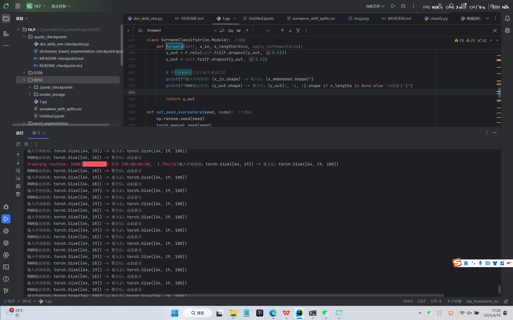

### 09 RNN
Surname-Classification-with-RNNs.py运行截图:

数据预处理验证运行截图:

模型结构验证运行截图:

RNN序列处理验证运行截图:

模型性能评估运行截图:

推理能力验证运行截图:

### 10 RNN

Model1_Conditioned_Surname_Generation运行截图:

有条件姓氏生成（学号尾数为3）:

### 回答问题
① 两个模型的核心差异体现在什么机制上？ B

- A. 字符编码方式不同
- B. 是否考虑国家信息作为生成条件
- C. RNN单元类型不同（GRU/LSTM）
- D. 损失函数计算方式不同

② 在条件生成模型（Model2_Conditioned_Surname_Generation）中，国家信息通过什么方式影响生成过程？ A

- A. 作为额外的输入特征拼接
- B. 作为GRU的初始隐藏状态
- C. 作为注意力机制的key
- D. 作为输出层的偏置项

③ 文件2中新增的nation_emb层的主要作用是：B

self.nation_emb = nn.Embedding(num_nationalities, rnn_hidden_size)
- A. 将字符索引映射为稠密向量
- B. 将国家标签转换为隐藏状态初始化向量
- C. 生成姓氏的长度控制参数
- D. 计算交叉熵损失的辅助参数

④ 对比两个文件的sample_from_model函数，文件2新增了哪个关键参数？  B

- A. temperature
- B. nationalities
- C. device
- D. max_length
